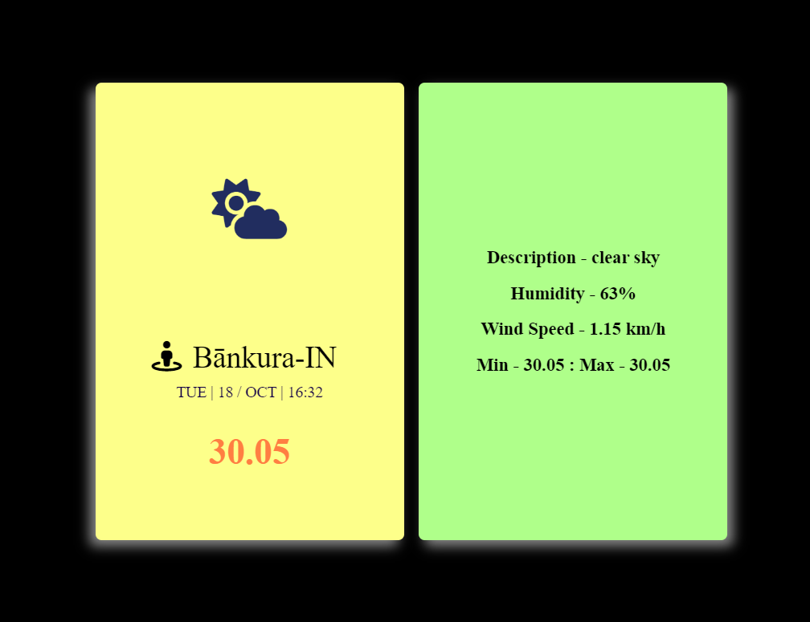

# Weather-app
A real-time weather app based on openweathermap api

# How to run the website
- Run the "index.js" file (locally in VS Code)
- open localhost:5000

- "index.html" file is the UI page.

https://locaweatherapp.herokuapp.com/

# Hosted in [server](https://app.cyclic.sh/#/app/devil-99-weather-app/overview)
[local-weather](https://local-weather.cyclic.app)
